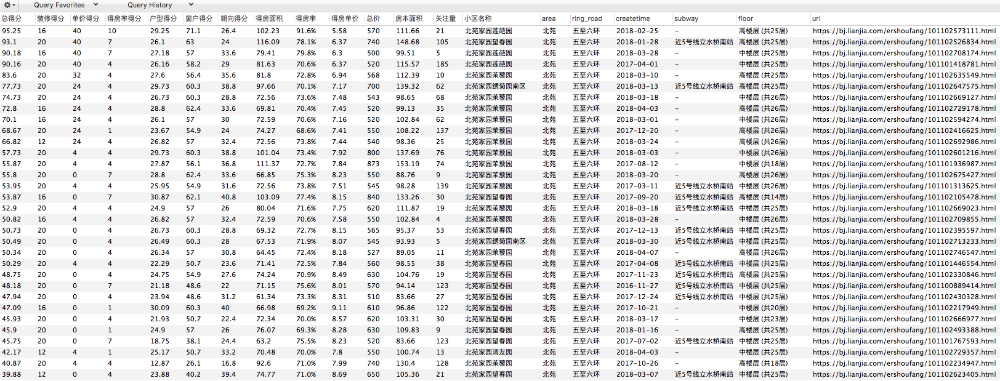

## 挺用心的链家爬虫（速度更快  数据更全  评分更有意义）

### 网上抓取链家数据的爬虫很多 但有几个问题：
```
1、 在售二手房爬取的数据不全（实际在售二手房房源大概4万套），但由于每页展示30条，
    但总共展示100页，也就是说爬取的仅仅是3000条在售二手房数据；

2、 没有各个小区的物业信息，物业费用能反应一个小区的中高低档；

3、 没有已成交记录的信息，并且近期链家对成交价格隐藏；

4、 抓取后没有数据处理；
```

这个网页抓取的脚本完美解决了以上问题；

### 同时，技术上使用了多进程+多协程的方法，提高抓取效率；
### 最后对每一个在售二手房进行评分：
根据是否有窗户、窗户是否是落地、窗户朝向、得房率（套内面价/建筑面积）、得房单价和装修维度搭建评分模型，给出一个百分制的分数；


### 几个使用上的简要说明：
```
1、xmind_logic.png 是这个抓取脚本设计的思维导图，主要介绍了该方法的设计思路以及较其他爬取不一样的点；

2、ershoufangdata.xlsx 是从二手房抓取结果中随机取的样本，重点在于对每个在售二手房的信息几乎全部涵盖，特别的可能有两个(赞)：1）每个房间的大小，窗户类型，已经朝向；2）每个房屋综合多个维度进行打分；使用者可以根据total_score字段排序来获得更理想的房子；

3、CreateTableSql.sql 是二手房、小区和成交房源表的建表语句，方便使用者直接无缝创建对应的表结构；

4、SelectSql.sql 列举了我常关注的几个维度(赞)，在查询中把我关注的点在where语句都有体现，使用者可以根据自己的喜好来调整查询条件；

5、LianJia 包中的score.py 按照是否有窗户、窗户是否是落地、窗户朝向、得房率（套内面价/建筑面积）、得房单价和装修维度写的评分算法，因为在房屋比较时我更关注这几个方面，且每一个方面不同的类型都有不同的权重，使用者可以根据自己的偏好，调整打分的特征维度和每种类型的比重；
```

### 设计思路


### 数据截图
